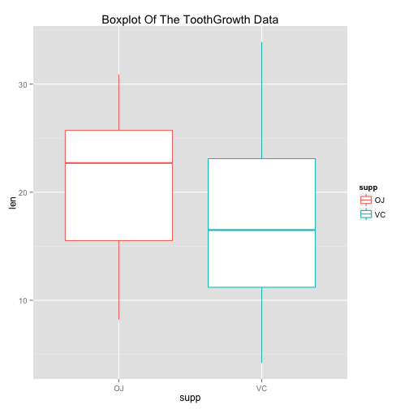
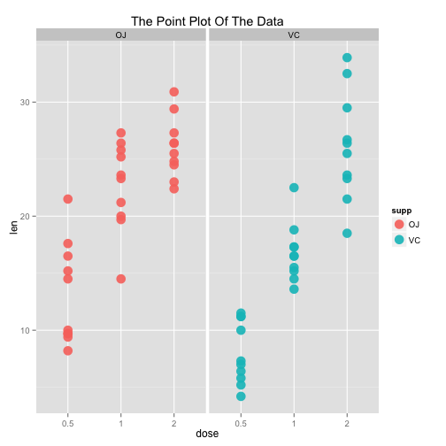
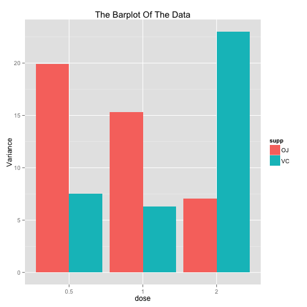
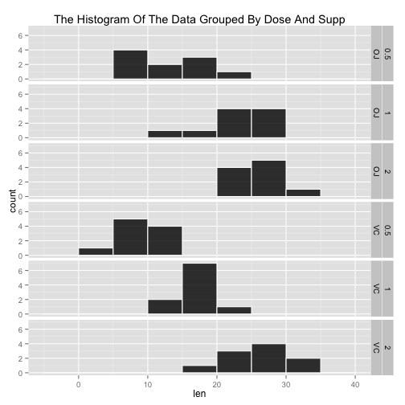

##An Appendix for Tooth Growth Analysis (R codes and figures)


```r
data("ToothGrowth")
library(ggplot2)
library(dplyr)
library(knitr)

#group the data by supp and dose
Tooth_by_Supp_Dose <- ToothGrowth %>%
    group_by(supp, dose)

#change class of dose into factor
Tooth_by_Supp_Dose$dose <- as.factor(Tooth_by_Supp_Dose$dose)

Var_By_Supp <- Tooth_by_Supp_Dose %>%
    group_by(supp, dose) %>%
    summarise(Variance = var(len))
```

summary of the data

```r
str(ToothGrowth)
```

```
## 'data.frame':	60 obs. of  3 variables:
##  $ len : num  4.2 11.5 7.3 5.8 6.4 10 11.2 11.2 5.2 7 ...
##  $ supp: Factor w/ 2 levels "OJ","VC": 2 2 2 2 2 2 2 2 2 2 ...
##  $ dose: num  0.5 0.5 0.5 0.5 0.5 0.5 0.5 0.5 0.5 0.5 ...
```

```r
summary(ToothGrowth)
```

```
##       len        supp         dose      
##  Min.   : 4.20   OJ:30   Min.   :0.500  
##  1st Qu.:13.07   VC:30   1st Qu.:0.500  
##  Median :19.25           Median :1.000  
##  Mean   :18.81           Mean   :1.167  
##  3rd Qu.:25.27           3rd Qu.:2.000  
##  Max.   :33.90           Max.   :2.000
```

boxplot


```r
summary_plot <- ggplot(data=ToothGrowth, aes(x=supp, y=len)) + 
    geom_boxplot(aes(color = supp)) +
    ggtitle("Boxplot Of The ToothGrowth Data")

summary_plot
```

 

point plot


```r
Growth_Plot <- ggplot(data = Tooth_by_Supp_Dose, aes(x=dose, y=len)) +
    geom_point(aes(color=supp), alpha=0.9, size = 5) +
    facet_grid(.~ supp) + 
    ggtitle("The Point Plot Of The Data")

Growth_Plot
```

 

barplot


```r
Bar_Plot <- ggplot(data=Var_By_Supp,aes(x=dose, y = Variance)) +
    geom_bar(aes(fill = supp), position = "dodge", stat="identity") + 
    ggtitle("The Barplot Of The Data")
Bar_Plot
```

 

histogram of variances


```r
#So variances are unequal.
Hist_Plot <- ggplot(data= Tooth_by_Supp_Dose, aes(len)) + 
    geom_histogram(binwidth=5,colour = "white",fill = "black",alpha=0.8) + 
    facet_grid(supp + dose ~ .) + 
    ggtitle("The Histogram Of The Data Grouped By Dose And Supp")

Hist_Plot
```

 

```r
#the assumption that the data distributed in the shape of mound is acceptable, since each unite of observations is identical and randomly chosen. 
```

The t test on the group (OJ, 0.5) and the group (VC, 0.5):


```r
Dose_0.5 <- filter(ToothGrowth, dose == 0.5)
test_0.5 <- t.test(len ~ supp, paired = FALSE, var.equal = FALSE, data = Dose_0.5)
test_0.5
```

```
## 
## 	Welch Two Sample t-test
## 
## data:  len by supp
## t = 3.1697, df = 14.969, p-value = 0.006359
## alternative hypothesis: true difference in means is not equal to 0
## 95 percent confidence interval:
##  1.719057 8.780943
## sample estimates:
## mean in group OJ mean in group VC 
##            13.23             7.98
```

The t test on the group (OJ, 1) and the group (VC, 1):


```r
Dose_1.0 <- filter(ToothGrowth, dose == 1.0)
test_1.0 <- t.test(len ~ supp, paired = FALSE, var.equal = FALSE, data = Dose_1.0)
test_1.0
```

```
## 
## 	Welch Two Sample t-test
## 
## data:  len by supp
## t = 4.0328, df = 15.358, p-value = 0.001038
## alternative hypothesis: true difference in means is not equal to 0
## 95 percent confidence interval:
##  2.802148 9.057852
## sample estimates:
## mean in group OJ mean in group VC 
##            22.70            16.77
```

The t test on the group (OJ, 2) and the group (VC, 2):


```r
Dose_2.0 <- filter(ToothGrowth, dose == 2.0)
test_2.0 <- t.test(len ~ supp, paired = FALSE, var.equal = FALSE, data = Dose_2.0)
test_2.0
```

```
## 
## 	Welch Two Sample t-test
## 
## data:  len by supp
## t = -0.046136, df = 14.04, p-value = 0.9639
## alternative hypothesis: true difference in means is not equal to 0
## 95 percent confidence interval:
##  -3.79807  3.63807
## sample estimates:
## mean in group OJ mean in group VC 
##            26.06            26.14
```
